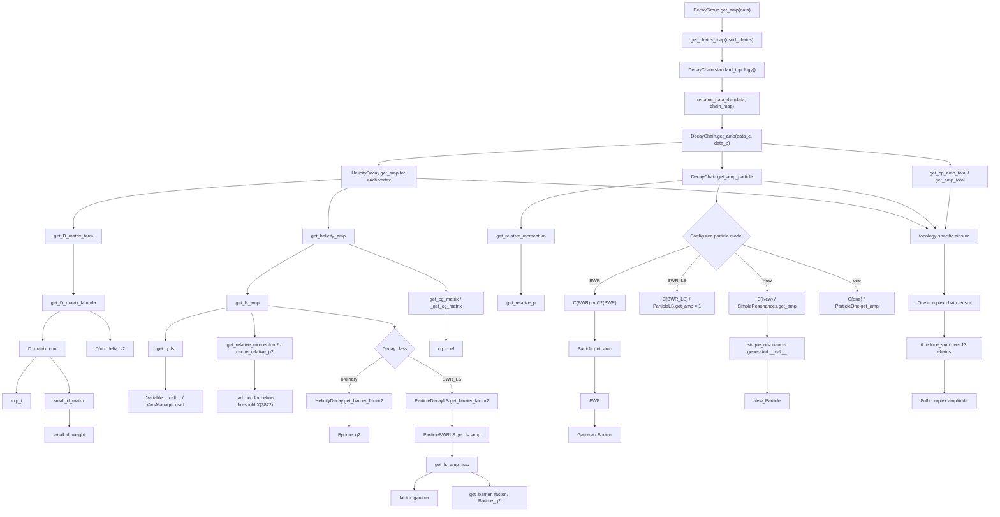

# Full configured complex-amplitude execution flow in TF-PWA

This document follows the TF-PWA code path that evaluates the coherent complex
amplitude of every component enabled in `config_a.yml`. It connects runtime
function calls to the corresponding calculations and stops only when the
remaining values come directly from event four-vectors, the YAML configuration,
or the JSON parameter file.

The implementation is taken from the TF-PWA source in
[`tf-pwa/tf_pwa`](../tf-pwa/tf_pwa) and the analysis-specific models registered
in [`extra_amp.py`](../Analysis/extra_amp.py). No documentation-only helper
functions are introduced.

## 1. Result being calculated

The configured model contains eleven chains with a resonance or nonresonant
component in the `DstD` system and two chains in the `DK` system. For one event
`x`, `DecayGroup.get_amp` returns their coherent sum:

$$
A_{abcde}(x)=\sum_{r\in\mathcal{R}} A^{(r)}_{abcde}(x).
$$

Here `r` labels one configured decay chain, while `a`, `b`, `c`, `d`, and `e`
label the external helicities of `Bp`, `D`, `D0`, `K`, and `pi`. All five
external particles have spin zero, so each external index has length one. A
later `reshape(-1)[0]` therefore selects the only external-helicity component;
it does not discard additional physical helicity amplitudes.

### 1.1 DstD topology

The eleven `DstD` components use

```text
Bp -> R K
R  -> Dst D
Dst -> D0 pi
```

and TF-PWA contracts them as

$$
A^{(r)}_{abcde}(x)=g_r\,R_r(x)
\sum_{\lambda_R}\sum_{\lambda_{D^{*}}}
T^{B,r}_{a\lambda_R d}(x)
T^{R,r}_{\lambda_R\lambda_{D^{*}}b}(x)
T^{D^{*}}_{\lambda_{D^{*}}ce}(x).
$$

The exact dynamic contraction generated by `DecayChain.get_amp` is

```python
einsum(
    "...agd,...gfb,...fce,...->...abcde",
    root_amp,
    resonance_decay_amp,
    dst_amp,
    chain_total * particle_factors,
)
```

The indices `g` and `f` are the summed `R` and `Dst` helicities.

### 1.2 DK topology

The two `X(2900)` components instead use

```text
Bp -> R Dst
R  -> D K
Dst -> D0 pi
```

Their chain amplitude is

$$
A^{(r)}_{abcde}(x)=g_r\,R_r(x)
\sum_{\lambda_R}\sum_{\lambda_{D^{*}}}
T^{B,r}_{a\lambda_R\lambda_{D^{*}}}(x)
T^{R,r}_{\lambda_Rbd}(x)
T^{D^{*}}_{\lambda_{D^{*}}ce}(x),
$$

implemented by

```python
einsum(
    "...agf,...gde,...fbc,...->...abcde",
    root_amp,
    resonance_decay_amp,
    dst_amp,
    chain_total * particle_factors,
)
```

The different index order follows the different daughter order in the decay
tree; both expressions return the same external ordering.

### 1.3 Active component inventory

The LS pairs below are generated from the configured spins, parities, and
explicit restrictions by `Decay.get_ls_list`. `L,S` denotes orbital angular
momentum and coupled daughter spin.

| Chain index | Component | Topology | Spin-parity | Production LS | Component-decay LS | Particle model | Factor at `c = -1` |
|---:|---|---|---|---|---|---|---:|
| 0 | `X(3872)` | `DstD` | `1+` | `(1,1)` | `(0,1)`, `(2,1)` | `C(BWR_LS)` | `-1` |
| 1 | `X(3915)(0-)` | `DstD` | `0-` | `(0,0)` | `(1,1)` | `C(BWR)` | `-1` |
| 2 | `chi(c2)(3930)` | `DstD` | `2+` | `(2,2)` | `(2,1)` | `C(BWR)` | `-1` |
| 3 | `X(3940)(1+)` | `DstD` | `1+` | `(1,1)` | `(0,1)`, `(2,1)` | `C(BWR_LS)` | `+1` |
| 4 | `X(3993)` | `DstD` | `1+` | `(1,1)` | `(0,1)`, `(2,1)` | `C(BWR_LS)` | `-1` |
| 5 | `Psi(4040)` | `DstD` | `1-` | `(1,1)` | `(1,1)` | `C(BWR)` | `+1` |
| 6 | `X(4300)` | `DstD` | `1+` | `(1,1)` | `(0,1)`, `(2,1)` | `C(BWR_LS)` | `+1` |
| 7 | `NR(0-)SPp` | `DstD` | `0-` | `(0,0)` | `(1,1)` | `C(New)` | `-1` |
| 8 | `NR(1+)PSp` | `DstD` | `1+` | `(1,1)` | `(0,1)` | `C(one)` | `-1` |
| 9 | `NR(0-)SPm` | `DstD` | `0-` | `(0,0)` | `(1,1)` | `C(one)` | `+1` |
| 10 | `NR(1-)PPm` | `DstD` | `1-` | `(1,1)` | `(1,1)` | `C(one)` | `+1` |
| 11 | `X0(2900)` | `DK` | `0+` | `(1,1)` | `(0,0)` | `C2(BWR)` | `+1` |
| 12 | `X1(2900)` | `DK` | `1-` | `(0,0)`, `(1,1)`, `(2,2)` | `(1,0)` | `C2(BWR)` | `+1` |

Commented-out entries in `config_a.yml` are not members of the sum. Runtime
parameter names render positive parity with a dot, for example
`X(3940)(1.)`, but this denotes the same configured `X(3940)(1+)` component.

## 2. Script entry point and input leaves

### 2.1 Full-model evaluation

A minimal full-model call loads the fitted parameter values, constructs event
data, and evaluates every enabled chain:

```python
import json
import numpy as np
import tensorflow as tf

import extra_amp  # registers New, C(...), and C2(...)
from tf_pwa.config_loader import ConfigLoader

config = ConfigLoader("config_a.yml")
with open("final_params_full.json", encoding="utf-8") as stream:
    params = json.load(stream)["value"]

phsp_variables = config.data.cal_angle(p4_dict)
phsp_variables["c"] = np.full(number_of_events, -1.0)

amp_model = config.get_amplitude()
config.set_params(params)
value = amp_model.decay_group.get_amp(phsp_variables)
```

The non-function leaves are:

- final-state four-vectors for `D`, `D0`, `K`, and `pi`;
- the event selector `c = -1`;
- particle definitions, decay trees, model names, and decay options from
  [`config_a.yml`](../Analysis/config_a.yml) and
  [`Resonances.yml`](../Analysis/Resonances.yml);
- fitted masses, widths, shape parameters, chain totals, and LS couplings from
  the `value` object in
  [`final_params_full.json`](../Analysis/final_params_full.json).

### 2.2 Complex parameters

TF-PWA uses polar complex variables by default. Every chain total and complex
LS coupling stored with suffixes `r` and `i` is read as

$$
g=r\,e^{i\phi}=r\left(\cos\phi+i\sin\phi\right),
$$

where the value with suffix `i` is the phase `phi`, not a Cartesian imaginary
part. `ConfigLoader.set_params` applies all fitted values before amplitude
evaluation. The full calculation therefore retains, rather than replaces, the
relative magnitudes and phases required for interference.

The additional real shape parameters are `mass` and `width` for resonant
models, `theta0` for each two-wave `BWR_LS` model, and `alpha` and `beta` for
`NR(0-)SPp`.

## 3. Complete call path

The common forward path and its model-dependent branches are

```text
import extra_amp
|-- simple_resonance("New")
|   `-- register_particle("New")
`-- create_particle(model_name)
    |-- get_particle_model(model_name)
    |-- register_particle("C(model_name)")
    `-- register_particle("C2(model_name)")

ConfigLoader("config_a.yml")
|-- get_particle
|   `-- get_particle_model
|-- get_decay
|   `-- ParticleDecayLS for BWR_LS resonance decays
`-- HelicityDecay.get_ls_list
    `-- Decay.get_ls_list
        `-- GetA2BC_LS_list

Data.cal_angle(p4_dict)
`-- cal_angle_from_momentum
    `-- cal_angle_from_momentum_id_swap
        `-- cal_angle_from_momentum_base
            `-- cal_angle_from_momentum_single
                |-- struct_momentum
                |-- infer_momentum
                |-- add_mass
                |-- cal_angle_from_particle
                |   |-- cal_chain_boost
                |   |   `-- LorentzVector.rest_vector
                |   |       |-- LorentzVector.boost_vector
                |   |       `-- LorentzVector.boost
                |   |-- cal_helicity_angle
                |   |   `-- EulerAngle.angle_zx_z_getx
                |   |       |-- Vector3.unit
                |   |       |-- Vector3.cross_unit
                |   |       `-- Vector3.angle_from
                |   |-- aligned_angle_ref_rule1
                |   `-- aligned_angle_ref_rule2
                `-- add_relative_momentum
                    `-- Getp2

ConfigLoader.get_amplitude
`-- create_amplitude
    `-- BaseAmplitudeModel.init_params
        `-- DecayGroup.init_params
            |-- Particle.init_params                   [ordinary BWR]
            |-- ParticleBWRLS.init_params              [mass, width, theta]
            |-- simple_resonance-generated init_params [New alpha and beta]
            |-- DecayChain.init_params                 [chain total]
            |-- HelicityDecay.init_params              [ordinary g_ls]
            `-- ParticleDecayLS.init_params             [BWR_LS g_ls]

ConfigLoader.set_params(params)
`-- AbsPDF.set_params
    `-- VarsManager.set_all
        `-- VarsManager.set

DecayGroup.get_amp(data)
|-- DecayGroup.get_chains_map
|-- DecayChain.standard_topology
|-- rename_data_dict
|-- DecayChain.get_amp                         [once per enabled chain]
|   |-- HelicityDecay.get_amp                 [three vertices]
|   |   |-- HelicityDecay.get_D_matrix_term
|   |   |   `-- get_D_matrix_lambda
|   |   |       |-- get_D_matrix_for_angle
|   |   |       |   `-- D_matrix_conj
|   |   |       |       |-- exp_i
|   |   |       |       `-- small_d_matrix
|   |   |       |           `-- small_d_weight
|   |   |       `-- Dfun_delta_v2
|   |   `-- HelicityDecay.get_helicity_amp
|   |       |-- HelicityDecay.get_ls_amp
|   |       |   |-- HelicityDecay.get_g_ls
|   |       |   |   `-- Variable.__call__
|   |       |   |       `-- VarsManager.read
|   |       |   |-- HelicityDecay.get_relative_momentum2
|   |       |   |   |-- _ad_hoc                  [X(3872) nominal q0 only]
|   |       |   |   `-- get_relative_p2
|   |       |   |-- HelicityDecay.cache_relative_p2
|   |       |   `-- get_barrier_factor2
|   |       |       |-- HelicityDecay.get_barrier_factor2
|   |       |       |   `-- Bprime_q2             [ordinary vertices]
|   |       |       `-- ParticleDecayLS.get_barrier_factor2
|   |       |           `-- ParticleBWRLS.get_ls_amp
|   |       |               `-- ParticleBWRLS.get_ls_amp_frac
|   |       |                   |-- ParticleBWRLS.factor_gamma
|   |       |                   `-- ParticleBWRLS.get_barrier_factor
|   |       |                       `-- Bprime_q2
|   |       `-- HelicityDecay.get_cg_matrix
|   |           `-- HelicityDecay._get_cg_matrix
|   |               `-- cg_coef
|   |-- DecayChain.get_amp_particle
|   |   |-- HelicityDecay.get_relative_momentum
|   |   |   |-- _ad_hoc                          [X(3872)]
|   |   |   `-- get_relative_p
|   |   |-- C(BWR).get_amp
|   |   |   `-- Particle.get_amp
|   |   |       `-- BWR
|   |   |           `-- Gamma
|   |   |               `-- Bprime
|   |   |-- C(BWR_LS).get_amp
|   |   |   `-- ParticleLS.get_amp               [returns one]
|   |   |-- C(New).get_amp
|   |   |   `-- SimpleResonances.get_amp
|   |   |       `-- simple_resonance-generated __call__
|   |   |           `-- New_Particle
|   |   |-- C(one).get_amp
|   |   |   `-- ParticleOne.get_amp
|   |   `-- C2(BWR).get_amp
|   |       `-- Particle.get_amp
|   |           `-- BWR
|   |-- DecayChain.get_cp_amp_total
|   |   `-- DecayChain.get_amp_total
|   |       `-- Variable.__call__
|   `-- einsum                                 [topology-specific contraction]
`-- tf.reduce_sum                              [coherent chain sum]
```

The identical-particle and CP-swap preprocessing wrappers are entered by the
generic data pipeline. No identical-particle permutation or configured
CP-particle replacement is added for this final state.

## 4. Event-data branch

### 4.1 Intermediate four-vectors and masses

`cal_angle_from_momentum_single` starts from the four final-state vectors.
`infer_momentum` reconstructs each topology by daughter-vector addition.

For the `DstD` topology,

$$
p_{D^{*}}=p_{D^0}+p_{\pi},
$$

$$
p_R=p_{D^{*}}+p_D,
$$

$$
p_B=p_R+p_K.
$$

For the `DK` topology,

$$
p_{D^{*}}=p_{D^0}+p_{\pi},
$$

$$
p_R=p_D+p_K,
$$

$$
p_B=p_R+p_{D^{*}}.
$$

`add_mass` evaluates every invariant mass with metric `(+,-,-,-)`:

$$
m(p)=\sqrt{\left|E^2-\boldsymbol{p}^{\,2}\right|}.
$$

The resulting vectors and masses are stored in the particle-data branch and
are reused by all chains with the same standard topology.

### 4.2 Sequential rest-frame boosts

`cal_chain_boost` processes each decay tree from `Bp` toward `Dst`.
`LorentzVector.rest_vector(core, other)` obtains

$$
\boldsymbol{\beta}_{\mathrm{core}}=
\frac{\boldsymbol{p}_{\mathrm{core}}}{E_{\mathrm{core}}}
$$

and calls the generic boost with `b = -beta_core`. The source implements

$$
\gamma=\frac{1}{\sqrt{1-\boldsymbol{b}^{\,2}}},
$$

$$
E'=\gamma\left(E+\boldsymbol{b}\cdot\boldsymbol{p}\right),
$$

$$
\boldsymbol{p}'=\boldsymbol{p}+
\left[
\frac{\gamma-1}{\boldsymbol{b}^{\,2}}
\left(\boldsymbol{b}\cdot\boldsymbol{p}\right)+\gamma E
\right]\boldsymbol{b}.
$$

Each vertex angle is therefore constructed from daughter momenta in the
corresponding mother rest frame.

### 4.3 Helicity Euler angles and alignment

At each two-body vertex, `cal_helicity_angle` uses the first listed daughter to
define the outgoing `z` axis. Given incoming axes `z1,x1` and the new direction
`z2`, `EulerAngle.angle_zx_z_getx` constructs normalized frame axes and returns

$$
\alpha=\mathrm{atan2}\left(
\widehat{\boldsymbol{x}}_r\cdot\widehat{\boldsymbol{y}}_1,
\widehat{\boldsymbol{x}}_r\cdot\widehat{\boldsymbol{x}}_1
\right),
$$

$$
\beta=\mathrm{atan2}\left(
\widehat{\boldsymbol{z}}_2\cdot\widehat{\boldsymbol{x}}_r,
\widehat{\boldsymbol{z}}_2\cdot\widehat{\boldsymbol{z}}_1
\right),
$$

$$
\gamma=0.
$$

The transported axis for the next decay is

$$
\widehat{\boldsymbol{x}}_2=
\frac{\widehat{\boldsymbol{y}}_r\times\widehat{\boldsymbol{z}}_2}
{\left|\widehat{\boldsymbol{y}}_r\times\widehat{\boldsymbol{z}}_2\right|}.
$$

The source also applies its daughter-dependent range convention to `alpha`.
`aligned_angle_ref_rule1` or `aligned_angle_ref_rule2` then supplies alignment
angles where a spinful state must be expressed in the common basis used for
coherent contraction. This step is part of the generic chain assembly and is
especially relevant when the `DstD` and `DK` topologies are combined.

### 4.4 Cached event breakup momentum

`add_relative_momentum` stores event `|q|2` for every two-body decay through
`Getp2`:

$$
q^2_{\mathrm{event}}=
\frac{
\left[m_a-(m_b+m_c)\right]
\left[m_a+(m_b+m_c)\right]
\left[m_a-(m_b-m_c)\right]
\left[m_a+(m_b-m_c)\right]
}{4m_a^2}.
$$

The vertex functions consume this cached squared momentum. Particle models
that need unsquared `q` and `q0` obtain them separately in
`DecayChain.get_amp_particle`.

## 5. Model construction and runtime parameters

Before `ConfigLoader` reads the YAML model names, importing `extra_amp.py`
registers the analysis-specific models. `simple_resonance("New")` converts
`New_Particle` into a `SimpleResonances` particle class. `create_particle`
looks up existing particle classes and registers subclasses named `C(...)`,
`C2(...)`, and `C3(...)`; only the first two are active here.

During configuration loading, `get_particle` resolves each model name through
`get_particle_model`. A `ParticleBWRLS` object sets its decay model to
`LS-decay`, so `get_decay` constructs `ParticleDecayLS` instead of the default
`HelicityDecay` for that resonance-decay vertex. This is how the shared
multi-wave denominator is connected to the otherwise generic vertex path.

`HelicityDecay.get_ls_list` starts from `Decay.get_ls_list`, which calls
`GetA2BC_LS_list` with the configured spins, parities, and parity-breaking
option. It then applies any explicit `l_list` restriction.

When `create_amplitude` constructs the model, `BaseAmplitudeModel.init_params`
enters `DecayGroup.init_params`. The particle initialization methods create
ordinary resonance masses and widths, `BWR_LS` mixing angles, and the `New`
model's `alpha` and `beta`; the chain and decay initialization methods create
the chain totals and LS couplings. These are the live variables subsequently
filled from the JSON file.

Finally, `ConfigLoader.set_params(params)` reaches the live variables through

```text
ConfigLoader.set_params
-> AbsPDF.set_params
-> VarsManager.set_all
-> VarsManager.set
-> tf.Variable.assign
```

`Variable.__call__` later reconstructs the fitted complex chain totals and LS
couplings. The chain coefficient is multiplied only after all vertex tensors
and intermediate particle factors have been evaluated.

## 6. Top-level amplitude dispatch

`ConfigLoader.get_amplitude` calls `create_amplitude` and returns the runtime
model containing the configured `DecayGroup`. `DecayGroup.get_amp` then follows
this source structure:

```python
data_particle = data["particle"]
data_decay = data["decay"]
used_chains = tuple(self.chains[i] for i in self.chains_idx)
chain_maps = self.get_chains_map(used_chains)
ret = []

for chains in chain_maps:
    for decay_chain in chains:
        chain_topo = decay_chain.standard_topology()
        data_c = rename_data_dict(data_decay_i, chains[decay_chain])
        data_p = rename_data_dict(data_particle, chains[decay_chain])
        ret.append(
            decay_chain.get_amp(data_c, data_p, base_map=base_map, all_data=data)
        )

return tf.reduce_sum(ret, axis=0)
```

`get_chains_map`, `standard_topology`, and `rename_data_dict` allow all named
resonances to reuse kinematics calculated for one of the two standard
topologies. The final `tf.reduce_sum` is a complex amplitude sum, so all
component interference is retained.

## 7. Common two-body decay tensors

### 7.1 Tensor structure

For every two-body decay `a -> b c`, `HelicityDecay.get_amp` multiplies a
conjugated Wigner matrix by an LS-derived helicity coupling:

$$
T^{a\to bc}_{\lambda_a\lambda_b\lambda_c}(x)=
D^{J_a*}_{\lambda_a,\lambda_b-\lambda_c}
\left(\Omega_{a\to bc}(x)\right)
H^{a\to bc}_{\lambda_b\lambda_c}(x).
$$

The source implementation is

```python
D_conj = self.get_D_matrix_term(data, data_p, **kwargs)
H = self.get_helicity_amp(data, data_p, **kwargs)
H = tf.reshape(H, (-1, 1, *self.n_helicity_inner()))
ret = tf.cast(H, D_conj.dtype) * tf.stop_gradient(D_conj)
```

### 7.2 Wigner-D factor

`get_D_matrix_term` calls `get_D_matrix_lambda`, which selects the second matrix
index `lambda_b - lambda_c`. TF-PWA uses

$$
D^{J*}_{mn}(\alpha,\beta,\gamma)=
e^{im\alpha}d^J_{mn}(\beta)e^{in\gamma}.
$$

`D_matrix_conj` obtains the phases from `exp_i` and the reduced matrix from
`small_d_matrix`. The latter evaluates

$$
d^J_{mn}(\beta)=\sum_{k=0}^{2J}
w_k^{(J,m,n)}
\sin^k\left(\frac{\beta}{2}\right)
\cos^{2J-k}\left(\frac{\beta}{2}\right),
$$

where `small_d_weight` supplies the factorial coefficients and forbidden terms.
`Dfun_delta_v2` gathers only entries allowed by the configured helicity lists.

### 7.3 LS-to-helicity recoupling

`get_helicity_amp` performs the LS sum

$$
H_{\lambda_b\lambda_c}(x)=
\sum_{L,S}M_{LS}(x)G_{\lambda_b\lambda_c}^{LS},
$$

with

$$
G_{\lambda_b\lambda_c}^{LS}=
\sqrt{\frac{2L+1}{2J_a+1}}
\left\langle J_b,\lambda_b;J_c,-\lambda_c
\middle|S,\lambda_b-\lambda_c\right\rangle
\left\langle L,0;S,\lambda_b-\lambda_c
\middle|J_a,\lambda_b-\lambda_c\right\rangle.
$$

`HelicityDecay._get_cg_matrix` constructs this matrix and `cg_coef` evaluates
the two Clebsch-Gordan coefficients. Multiple allowed LS entries are summed at
the vertex before the chain helicities are contracted.

### 7.4 Ordinary vertex mass dependence

For a normal `HelicityDecay`, `get_ls_amp` reads `g_ls`, obtains nominal
`q0^2`, retrieves event `q^2`, and calls
`HelicityDecay.get_barrier_factor2`. With the configured normalized barrier
factors,

$$
M_{LS}(q)=g_{LS}
\left(\frac{q}{|q_0|}\right)^L
B'_L(q,q_0,d),
$$

where

$$
B'_L(q,q_0,d)=
\sqrt{\frac{P_L(q_0^2d^2)}{P_L(q^2d^2)}}.
$$

The production and component-decay entries in `config_a.yml` set
`barrier_factor_norm: True`. The `Dst -> D0 pi` entry sets
`has_barrier_factor: False`, so its LS mass dependence is only its fitted
coupling.

## 8. Model-specific mass dependence

### 8.1 Ordinary running-width BWR

`X(3915)(0-)`, `chi(c2)(3930)`, `Psi(4040)`, `X0(2900)`, and `X1(2900)` use the
ordinary `Particle.get_amp` running-width path. `Particle.get_amp` chooses
`L = min(decay.get_l_list())` and calls

$$
R(m)=\frac{1}{m_0^2-m^2-i m_0\Gamma(m)},
$$

with

$$
\Gamma(m)=\Gamma_0
\left(\frac{q}{q_0}\right)^{2L+1}
\frac{m_0}{m}
\left[B'_L(q,q_0,d)\right]^2.
$$

`DecayChain.get_amp_particle` obtains `q` from event mother and daughter masses
and `q0` from nominal masses through `HelicityDecay.get_relative_momentum`.
This unsquared-momentum path is separate from the vertex `q^2/q0^2` path in
Section 7.4.

### 8.2 Shared-denominator BWR_LS

`X(3872)`, `X(3940)(1+)`, `X(3993)`, and `X(4300)` have two component-decay
partial waves. `ParticleBWRLS.factor_gamma` converts their fitted angle to

$$
\gamma_0=\cos\theta_0,
\qquad
\gamma_1=\sin\theta_0,
$$

and `ParticleBWRLS.get_barrier_factor` calculates

$$
u_i(m)=\gamma_i
\left(\sqrt{\frac{q^2}{q_0^2}}\right)^{L_i}
B'_{L_i}(q^2,q_0^2,d).
$$

With the default `fix_bug1 = False`, `get_ls_amp_frac` constructs the common
denominator

$$
\Delta(m)=m_0^2-m^2
-i\,m_0\Gamma_0
\sqrt{\frac{q^2}{q_0^2}}
\left(\sum_i u_i^2\right)
\frac{m}{m_0}.
$$

`ParticleBWRLS.get_ls_amp` returns one numerator-over-denominator value for
each partial wave:

$$
R_i(m)=\frac{u_i(m)}{\Delta(m)}.
$$

The generic `HelicityDecay.get_ls_amp` then includes the fitted complex LS
coupling:

$$
M_i(m)=g_i^{LS}R_i(m).
$$

The integration point is important. `ParticleDecayLS.get_barrier_factor2`
calls `self.core.get_ls_amp(...)`, so `R_i` enters the corresponding LS term of
the resonance-decay tensor. In the separate particle call, the underlying
`ParticleLS.get_amp` returns `1 + 0i`; `C(BWR_LS).get_amp` can add only its
event-selector sign. The shared propagator is not multiplied a second time.

For `X(3872)`, the nominal mass lies below the `Dst D` threshold.
`HelicityDecay.get_relative_momentum2` therefore applies `_ad_hoc` before
calculating nominal `q0^2`:

$$
k=\frac{m_{\max}-m_{\min}}{2},
$$

$$
m_{\mathrm{eff}}=m_{\min}+k\left[
1+\tanh\left(
\frac{2m_0-(m_{\max}+m_{\min})}{4k}
\right)
\right],
$$

where `m_max = m_B - m_K` and `m_min = m_Dst + m_D`. This replacement is used
only when the nominal mother mass is below its daughter threshold.

### 8.3 Nonresonant models

The registered `one` model returns

$$
R(m)=1.
$$

It is used by `NR(1+)PSp`, `NR(0-)SPm`, `NR(1-)PPm`, and the common `Dst`
particle. Their event dependence still includes the angular tensors, LS
recoupling, vertex factors, and fitted complex coefficients.

`NR(0-)SPp` instead uses the function registered as `New`:

```python
@simple_resonance("New", params=["alpha", "beta"])
def New_Particle(m, alpha, beta):
    zeros = tf.zeros_like(m)
    r = -tf.complex(alpha, beta) * tf.complex(m**2 - 4.35**2, zeros)
    return tf.exp(r)
```

Thus

$$
R_{\mathrm{New}}(m)=
\exp\left[-(\alpha+i\beta)\left(m^2-(4.35\,\mathrm{GeV})^2\right)\right].
$$

`simple_resonance` creates the registered runtime particle class, while
`SimpleResonances.get_amp` supplies the event mass and live parameters to this
function.

### 8.4 Event-selector wrappers

`create_particle` registers `C(model)` with this source behavior:

```python
d = all_data["c"]
c = getattr(self, "C", 1)
if c == -1:
    return super().get_amp(data, data_d, all_data=None, **kwargs)
amp = super().get_amp(data, data_d, all_data=None, **kwargs)
return tf.where(d > 0, amp, -amp)
```

At event value `c = -1`, a particle with configured `C = +1` receives a minus
sign, while configured `C = -1` leaves the underlying model unchanged. These
signs are listed in Section 1.3.

The `X(2900)` states use `C2(BWR)`:

```python
d = all_data["c"]
amp = super().get_amp(data, data_d, all_data=None, **kwargs)
return tf.where(d > 0, tf.zeros_like(amp), amp)
```

They are therefore active and unchanged for `c = -1`; they would be zero for
events with `c > 0`.

## 9. Final chain assembly and coherent sum

For each component, `DecayChain.get_amp` evaluates three decay tensors,
multiplies the intermediate particle factors by the fitted chain total, appends
any required alignment matrix, and builds its index expression from
`amp_index`. The `DstD` and `DK` expressions are the two contractions shown in
Section 1.

`DecayGroup.get_amp` appends all thirteen resulting tensors and returns

```python
ret = tf.reduce_sum(ret, axis=0)
```

This is the full fitted complex amplitude. Squaring must occur only after the
sum if the desired observable is the coherent intensity:

$$
I(x)=\left|\sum_{r\in\mathcal{R}}A^{(r)}(x)\right|^2.
$$

Summing individual `|A_r|^2` values would remove interference and is not the
calculation performed by `DecayGroup.get_amp`.

## 10. Function reference

Every TF-PWA or analysis-specific function and runtime method named in the flow
above is listed here. The source link opens its implementation.

| Function | Inputs | Output and role | Source |
|---|---|---|---|
| `ConfigLoader.__init__` | YAML path and optional variable manager | Parses particle, decay, model, and data definitions. | [`config_loader.py`](../tf-pwa/tf_pwa/config_loader/config_loader.py#L66) |
| `get_particle` | Particle metadata and model name | Instantiates the particle class registered for that model. | [`core.py`](../tf-pwa/tf_pwa/amp/core.py#L131) |
| `get_particle_model` | Registered model name | Returns the corresponding particle-model class. | [`core.py`](../tf-pwa/tf_pwa/amp/core.py#L118) |
| `register_particle` | Model name and class | Adds a particle class to TF-PWA's model registry. | [`core.py`](../tf-pwa/tf_pwa/amp/core.py#L53) |
| `get_decay` | Mother, daughters, and decay options | Instantiates the registered decay class, including `LS-decay`. | [`core.py`](../tf-pwa/tf_pwa/amp/core.py#L179) |
| `Decay.get_ls_list` | Configured spins, parities, and decay options | Returns the allowed LS pairs for one decay. | [`particle.py`](../tf-pwa/tf_pwa/particle.py#L357) |
| `Decay.get_l_list` | One decay's LS list | Returns only the orbital angular momenta from the LS pairs. | [`particle.py`](../tf-pwa/tf_pwa/particle.py#L376) |
| `GetA2BC_LS_list` | Mother/daughter spin-parity quantum numbers | Enumerates angular-momentum and parity-compatible LS pairs. | [`particle.py`](../tf-pwa/tf_pwa/particle.py#L208) |
| `simple_resonance` | Model name, function, and parameter names | Wraps a scalar mass function in a registered TF-PWA particle class. | [`core.py`](../tf-pwa/tf_pwa/amp/core.py#L562) |
| `simple_resonance-generated _R.init_params` | Decorated function signature and configured defaults | Creates the live parameters requested by a simple model. | [`core.py`](../tf-pwa/tf_pwa/amp/core.py#L584) |
| `simple_resonance-generated _R.__call__` | Event mass and live model parameters | Calls the decorated scalar function and casts its result to complex. | [`core.py`](../tf-pwa/tf_pwa/amp/core.py#L605) |
| `New_Particle` | Event mass, `alpha`, and `beta` | Evaluates the analysis-specific complex exponential model. | [`extra_amp.py`](../Analysis/extra_amp.py#L12) |
| `create_particle` | Existing registered model name | Registers the analysis-specific `C`, `C2`, and `C3` subclasses. | [`extra_amp.py`](../Analysis/extra_amp.py#L113) |
| `Data.cal_angle` | Final-state four-vector dictionary | Starts configured event preprocessing. | [`data.py`](../tf-pwa/tf_pwa/config_loader/data.py#L205) |
| `cal_angle_from_momentum` | Four-vectors, decay group, and options | Adds the generic CP-swap preprocessing layer. | [`cal_angle.py`](../tf-pwa/tf_pwa/cal_angle.py#L763) |
| `cal_angle_from_momentum_id_swap` | Four-vectors and decay group | Adds configured identical-particle permutations; none occur here. | [`cal_angle.py`](../tf-pwa/tf_pwa/cal_angle.py#L720) |
| `cal_angle_from_momentum_base` | Four-vectors, decay group, and batch size | Batches events and calls the single-batch constructor. | [`cal_angle.py`](../tf-pwa/tf_pwa/cal_angle.py#L639) |
| `cal_angle_from_momentum_single` | One event batch | Constructs particle masses, angles, alignment data, and cached momenta. | [`cal_angle.py`](../tf-pwa/tf_pwa/cal_angle.py#L826) |
| `struct_momentum` | Particle-to-four-vector mapping | Wraps vectors in the event particle-data structure. | [`cal_angle.py`](../tf-pwa/tf_pwa/cal_angle.py#L139) |
| `infer_momentum` | Particle data and decay topology | Reconstructs intermediate vectors by summing daughters. | [`cal_angle.py`](../tf-pwa/tf_pwa/cal_angle.py#L159) |
| `add_mass` | Reconstructed particle data | Adds the invariant mass of every particle vector. | [`cal_angle.py`](../tf-pwa/tf_pwa/cal_angle.py#L175) |
| `cal_angle_from_particle` | Particle data and decay group | Builds helicity and cross-topology alignment angles. | [`cal_angle.py`](../tf-pwa/tf_pwa/cal_angle.py#L409) |
| `cal_chain_boost` | Particle data and one decay chain | Performs successive mother-rest-frame boosts. | [`cal_angle.py`](../tf-pwa/tf_pwa/cal_angle.py#L198) |
| `cal_helicity_angle` | Boosted chain data and initial axes | Produces Euler angles and transported axes for each vertex. | [`cal_angle.py`](../tf-pwa/tf_pwa/cal_angle.py#L263) |
| `LorentzVector.boost_vector` | Four-vector | Returns its spatial velocity. | [`angle.py`](../tf-pwa/tf_pwa/angle.py#L128) |
| `LorentzVector.rest_vector` | Core and target four-vectors | Boosts the target into the core rest frame. | [`angle.py`](../tf-pwa/tf_pwa/angle.py#L141) |
| `LorentzVector.boost` | Four-vector and boost vector | Applies the source Lorentz transformation. | [`angle.py`](../tf-pwa/tf_pwa/angle.py#L149) |
| `Vector3.unit` | Three-vector | Returns its normalized direction. | [`angle.py`](../tf-pwa/tf_pwa/angle.py#L51) |
| `Vector3.cross_unit` | Two three-vectors | Returns their normalized cross product with a degenerate-axis fallback. | [`angle.py`](../tf-pwa/tf_pwa/angle.py#L58) |
| `Vector3.angle_from` | Vector and two reference axes | Computes an oriented angle from two projections. | [`angle.py`](../tf-pwa/tf_pwa/angle.py#L70) |
| `EulerAngle.angle_zx_z_getx` | Incoming `z,x` and outgoing `z` | Produces `alpha`, `beta`, `gamma` and transports `x`. | [`angle.py`](../tf-pwa/tf_pwa/angle.py#L286) |
| `aligned_angle_ref_rule1` | Decay group and chain-angle data | Selects the default common spin-basis reference. | [`cal_angle.py`](../tf-pwa/tf_pwa/cal_angle.py#L347) |
| `aligned_angle_ref_rule2` | Decay group, angles, and particle data | Selects the center-of-mass alignment reference when configured. | [`cal_angle.py`](../tf-pwa/tf_pwa/cal_angle.py#L382) |
| `add_relative_momentum` | Complete event data | Adds cached event `|q|2` to every two-body decay. | [`cal_angle.py`](../tf-pwa/tf_pwa/cal_angle.py#L551) |
| `Getp2` | Event mother and daughter masses | Computes event breakup momentum squared. | [`cal_angle.py`](../tf-pwa/tf_pwa/cal_angle.py#L516) |
| `ConfigLoader.get_amplitude` | Optional variable manager and model name | Builds or returns the configured amplitude model. | [`config_loader.py`](../tf-pwa/tf_pwa/config_loader/config_loader.py#L210) |
| `create_amplitude` | Decay group and model options | Instantiates the registered amplitude-model class. | [`amp.py`](../tf-pwa/tf_pwa/amp/amp.py#L39) |
| `BaseAmplitudeModel.init_params` | Optional parameter-name prefix | Starts parameter creation for the complete decay group. | [`amp.py`](../tf-pwa/tf_pwa/amp/amp.py#L137) |
| `DecayGroup.init_params` | Optional parameter-name prefix | Initializes resonance, chain, and unique decay variables. | [`core.py`](../tf-pwa/tf_pwa/amp/core.py#L1665) |
| `Particle.init_params` | Configured ordinary-resonance metadata | Creates or wraps the live mass and width variables. | [`core.py`](../tf-pwa/tf_pwa/amp/core.py#L386) |
| `ParticleBWRLS.init_params` | Configured BWR_LS metadata and LS list | Creates mass, width, and partial-wave mixing-angle variables. | [`split_ls.py`](../tf-pwa/tf_pwa/amp/split_ls.py#L113) |
| `DecayChain.init_params` | Optional parameter-name prefix | Creates the complex chain-total variable. | [`core.py`](../tf-pwa/tf_pwa/amp/core.py#L1340) |
| `HelicityDecay.init_params` | Allowed LS list | Creates ordinary complex `g_ls` variables and fixes the reference entry. | [`core.py`](../tf-pwa/tf_pwa/amp/core.py#L787) |
| `ParticleDecayLS.init_params` | Allowed LS list and ratio/phase options | Creates the `g_ls` variables for a BWR_LS decay. | [`split_ls.py`](../tf-pwa/tf_pwa/amp/split_ls.py#L20) |
| `ConfigLoader.set_params` | Named parameter dictionary | Transfers file values to the runtime amplitude object. | [`config_loader.py`](../tf-pwa/tf_pwa/config_loader/config_loader.py#L1011) |
| `AbsPDF.set_params` | Named parameter dictionary | Forwards assignment to the variable manager. | [`amp.py`](../tf-pwa/tf_pwa/amp/amp.py#L91) |
| `VarsManager.set_all` | Parameter dictionary or flat list | Iterates over supplied parameter assignments. | [`variable.py`](../tf-pwa/tf_pwa/variable.py#L666) |
| `VarsManager.set` | Parameter name and value | Applies configured transforms and assigns a TensorFlow variable. | [`variable.py`](../tf-pwa/tf_pwa/variable.py#L562) |
| `VarsManager.read` | Parameter name | Reads one live scalar with its configured transformation. | [`variable.py`](../tf-pwa/tf_pwa/variable.py#L553) |
| `Variable.__call__` | Optional charge selector | Reconstructs one real or complex runtime parameter. | [`variable.py`](../tf-pwa/tf_pwa/variable.py#L1698) |
| `DecayGroup.get_chains_map` | Enabled named chains | Maps named chains onto reusable standard topologies. | [`particle.py`](../tf-pwa/tf_pwa/particle.py#L924) |
| `DecayChain.standard_topology` | Named decay chain | Returns its resonance-independent topology key. | [`particle.py`](../tf-pwa/tf_pwa/particle.py#L699) |
| `rename_data_dict` | Kinematic dictionary and particle map | Renames standard-topology entries for one named chain. | [`core.py`](../tf-pwa/tf_pwa/amp/core.py#L2201) |
| `DecayGroup.get_amp` | Complete event-data dictionary | Evaluates and coherently sums every enabled chain. | [`core.py`](../tf-pwa/tf_pwa/amp/core.py#L1716) |
| `DecayChain.get_amp` | Chain decay data, particle data, and full event data | Evaluates factors and contracts all chain helicities. | [`core.py`](../tf-pwa/tf_pwa/amp/core.py#L1407) |
| `DecayChain.amp_index` | Optional particle-to-index map | Assigns helicity-index letters used to construct the dynamic contraction. | [`core.py`](../tf-pwa/tf_pwa/amp/core.py#L1628) |
| `DecayChain.get_amp_particle` | Particle data and chain decay data | Evaluates and multiplies intermediate particle models. | [`core.py`](../tf-pwa/tf_pwa/amp/core.py#L1578) |
| `DecayChain.get_amp_total` | Optional charge | Reads the fitted chain-level complex coefficient. | [`core.py`](../tf-pwa/tf_pwa/amp/core.py#L1380) |
| `DecayChain.get_cp_amp_total` | Charge-conjugation selector | Selects the correct chain total when CP-dependent totals exist. | [`core.py`](../tf-pwa/tf_pwa/amp/core.py#L1395) |
| `einsum` | Index expression and chain factor tensors | Contracts internal helicities and preserves external indices. | [`einsum.py`](../tf-pwa/tf_pwa/einsum.py#L145) |
| `HelicityDecay.get_amp` | Vertex angles and particle data | Multiplies the Wigner factor by the helicity coupling. | [`core.py`](../tf-pwa/tf_pwa/amp/core.py#L1143) |
| `HelicityDecay.get_D_matrix_term` | Vertex angles and particle data | Requests Wigner elements for allowed helicities. | [`core.py`](../tf-pwa/tf_pwa/amp/core.py#L1154) |
| `get_D_matrix_lambda` | Euler angles, mother spin, and helicity lists | Selects elements with second index `lambda_b-lambda_c`. | [`dfun.py`](../tf-pwa/tf_pwa/dfun.py#L241) |
| `get_D_matrix_for_angle` | Euler-angle data and doubled spin | Caches or computes the full conjugated Wigner matrix. | [`dfun.py`](../tf-pwa/tf_pwa/dfun.py#L221) |
| `D_matrix_conj` | `alpha`, `beta`, `gamma`, and doubled spin | Evaluates the conjugated Wigner-D matrix. | [`dfun.py`](../tf-pwa/tf_pwa/dfun.py#L196) |
| `exp_i` | Angle and magnetic quantum numbers | Calculates the complex Wigner phase. | [`dfun.py`](../tf-pwa/tf_pwa/dfun.py#L176) |
| `small_d_matrix` | `beta` and doubled spin | Evaluates the reduced Wigner matrix. | [`dfun.py`](../tf-pwa/tf_pwa/dfun.py#L146) |
| `small_d_weight` | Doubled spin | Precomputes reduced-matrix polynomial weights. | [`dfun.py`](../tf-pwa/tf_pwa/dfun.py#L119) |
| `Dfun_delta_v2` | Complete D matrix and helicity lists | Gathers elements allowed by daughter-helicity differences. | [`dfun.py`](../tf-pwa/tf_pwa/dfun.py#L98) |
| `HelicityDecay.get_helicity_amp` | Vertex and particle data | Sums LS mass dependence times recoupling coefficients. | [`core.py`](../tf-pwa/tf_pwa/amp/core.py#L958) |
| `HelicityDecay.get_ls_list` | Configured decay metadata | Applies runtime LS selection and explicit `l_list` filtering. | [`core.py`](../tf-pwa/tf_pwa/amp/core.py#L1227) |
| `HelicityDecay.get_ls_amp` | Vertex and particle data | Combines LS couplings with ordinary or overridden mass dependence. | [`core.py`](../tf-pwa/tf_pwa/amp/core.py#L1034) |
| `HelicityDecay.get_g_ls` | Runtime parameter state | Reads active complex LS couplings. | [`core.py`](../tf-pwa/tf_pwa/amp/core.py#L1024) |
| `HelicityDecay.get_cg_matrix` | Vertex spin and LS metadata | Returns the cached LS-to-helicity matrix. | [`core.py`](../tf-pwa/tf_pwa/amp/core.py#L868) |
| `HelicityDecay._get_cg_matrix` | LS list and helicity options | Builds the matrix from two Clebsch-Gordan coefficients. | [`core.py`](../tf-pwa/tf_pwa/amp/core.py#L875) |
| `cg_coef` | Coupled spins and projections | Evaluates one Clebsch-Gordan coefficient. | [`cg.py`](../tf-pwa/tf_pwa/cg.py#L18) |
| `HelicityDecay.get_relative_momentum2` | Particle data and `from_data` flag | Computes nominal or event breakup momentum squared. | [`core.py`](../tf-pwa/tf_pwa/amp/core.py#L849) |
| `HelicityDecay.cache_relative_p2` | Vertex and particle data | Reuses cached event `|q|2` or calculates it. | [`core.py`](../tf-pwa/tf_pwa/amp/core.py#L1177) |
| `HelicityDecay.get_barrier_factor2` | Mother mass, `q2`, `q02`, and radius | Builds ordinary normalized vertex barrier factors. | [`core.py`](../tf-pwa/tf_pwa/amp/core.py#L1061) |
| `ParticleDecayLS.get_barrier_factor2` | Event mass, LS list, `q2`, `q02`, and radius | Inserts the `BWR_LS` partial-wave amplitudes into the decay vertex. | [`split_ls.py`](../tf-pwa/tf_pwa/amp/split_ls.py#L51) |
| `ParticleBWRLS.factor_gamma` | LS list and fitted theta variables | Produces normalized partial-wave fractions. | [`split_ls.py`](../tf-pwa/tf_pwa/amp/split_ls.py#L121) |
| `ParticleBWRLS.get_barrier_factor` | LS list, `q2`, `q02`, and radius | Computes the partial-wave momentum and barrier factors. | [`split_ls.py`](../tf-pwa/tf_pwa/amp/split_ls.py#L134) |
| `ParticleBWRLS.get_ls_amp_frac` | Mass, LS list, `q2`, `q02`, and radius | Constructs the shared denominator and partial-wave numerators. | [`split_ls.py`](../tf-pwa/tf_pwa/amp/split_ls.py#L189) |
| `ParticleBWRLS.get_ls_amp` | Mass, LS list, `q2`, `q02`, and radius | Returns one numerator-over-denominator amplitude per LS wave. | [`split_ls.py`](../tf-pwa/tf_pwa/amp/split_ls.py#L179) |
| `ParticleLS.get_amp` | Particle mass data | Returns unity because `BWR_LS` is already inserted at the vertex. | [`split_ls.py`](../tf-pwa/tf_pwa/amp/split_ls.py#L65) |
| `_ad_hoc` | Nominal mass and allowed mass endpoints | Maps a below-threshold nominal mass to the effective mass used for `q0`. | [`core.py`](../tf-pwa/tf_pwa/amp/core.py#L331) |
| `get_relative_p2` | Mother and daughter masses | Computes algebraic two-body breakup momentum squared. | [`core.py`](../tf-pwa/tf_pwa/amp/core.py#L318) |
| `HelicityDecay.get_relative_momentum` | Particle data and `from_data` flag | Computes nominal or event unsquared breakup momentum. | [`core.py`](../tf-pwa/tf_pwa/amp/core.py#L831) |
| `get_relative_p` | Mother and daughter masses | Computes threshold-protected two-body breakup momentum. | [`core.py`](../tf-pwa/tf_pwa/amp/core.py#L305) |
| `Bprime_q2` | `L`, `q2`, `q02`, and radius | Evaluates the squared-momentum Blatt-Weisskopf ratio. | [`breit_wigner.py`](../tf-pwa/tf_pwa/breit_wigner.py#L268) |
| `Bprime_polynomial` | Orbital order and polynomial argument | Evaluates the TF-PWA Blatt-Weisskopf polynomial. | [`breit_wigner.py`](../tf-pwa/tf_pwa/breit_wigner.py#L332) |
| `C(...).get_amp` | Particle data, decay data, and event selector | Applies the configured analysis-specific sign rule. | [`extra_amp.py`](../Analysis/extra_amp.py#L118) |
| `C2(...).get_amp` | Particle data, decay data, and event selector | Keeps the underlying model only for `c <= 0`. | [`extra_amp.py`](../Analysis/extra_amp.py#L130) |
| `Particle.get_amp` | Resonance mass data and decay momenta | Dispatches an ordinary resonance to `BW` or running-width `BWR`. | [`core.py`](../tf-pwa/tf_pwa/amp/core.py#L405) |
| `BWR` | Event mass, nominal mass/width, `q`, `q0`, `L`, and radius | Evaluates the relativistic running-width Breit-Wigner. | [`breit_wigner.py`](../tf-pwa/tf_pwa/breit_wigner.py#L76) |
| `Gamma` | Event mass, width, `q`, `q0`, `L`, nominal mass, and radius | Evaluates the mass-dependent width used by `BWR`. | [`breit_wigner.py`](../tf-pwa/tf_pwa/breit_wigner.py#L231) |
| `Bprime` | `L`, `q`, `q0`, and radius | Evaluates the unsquared-momentum Blatt-Weisskopf ratio. | [`breit_wigner.py`](../tf-pwa/tf_pwa/breit_wigner.py#L290) |
| `Bprime_num` | `L`, momentum, and radius | Returns the square root of one barrier polynomial. | [`breit_wigner.py`](../tf-pwa/tf_pwa/breit_wigner.py#L280) |
| `SimpleResonances.get_amp` | Particle mass data and optional decay data | Supplies mass, live shape parameters, and optional momenta to a simple model. | [`core.py`](../tf-pwa/tf_pwa/amp/core.py#L547) |
| `ParticleOne.get_amp` | Particle mass data | Returns a complex array of ones. | [`base.py`](../tf-pwa/tf_pwa/amp/base.py#L415) |

## 11. Compact execution checklist

For each event, the full amplitude is reconstructed in this order:

1. Import `extra_amp.py` so every model name used by the YAML file is registered.
2. Parse particles, topologies, model classes, allowed LS pairs, and decay options.
3. Load fitted values from the JSON `value` object and assign the live variables.
4. Reconstruct intermediate four-vectors and invariant masses for both topologies.
5. Boost daughters successively and calculate all helicity and alignment angles.
6. Cache event breakup momentum squared for every two-body vertex.
7. Build each Wigner-D tensor and LS-to-helicity recoupling matrix.
8. Insert ordinary vertex factors or the `BWR_LS` shared-denominator factors.
9. Evaluate the configured intermediate particle model and event-selector wrapper.
10. Multiply by the fitted chain total and contract internal helicities with `einsum`.
11. Repeat for all thirteen enabled chains and sum the complex tensors coherently.
12. Select the only external-helicity component when a scalar complex value is needed.

## 12. Nested function visualization

This diagram starts at the complex-amplitude method and shows where
the common path separates into the active particle models.


