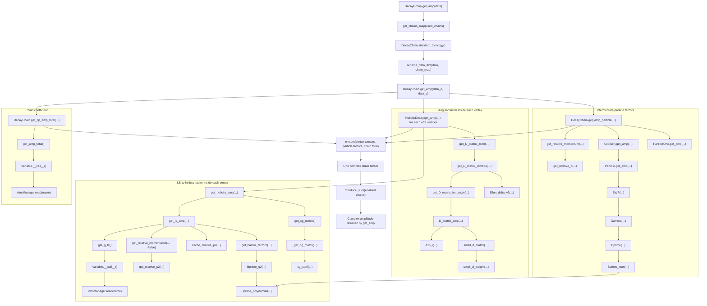

# Psi(4040) complex-amplitude execution flow in TF-PWA (revised)

This document follows the exact code path of TF-PWA to evaluate
one isolated `Psi(4040)` partial-wave amplitude. It connects the runtime calls
to the corresponding physics formulas and stops only when the remaining values
come directly from the input four-vectors, YAML configuration, or JSON parameter
file.

The description is derived from the TF-PWA source included in
[`tf-pwa/tf_pwa`](../tf-pwa/tf_pwa).

## 1. Result being calculated

The selected chain is

```text
Bp -> Psi(4040) K
Psi(4040) -> Dst D
Dst -> D0 pi
```

with chain index `5`. The script labels its only production and resonance-decay
partial wave as `Psi(4040) [L=1, l=1]`.

For one event, TF-PWA constructs three decay tensors and contracts the two
internal helicities. Written with explicit indices, the result is

$$
A_{a b c d e}(x)=g_{\mathrm{chain}}\,R_{\psi}(m_{D^{*}D})\sum_{\lambda_{\psi}}\sum_{\lambda_{D^{*}}}T^{B}_{a\lambda_{\psi}d}(x)\,T^{\psi}_{\lambda_{\psi}\lambda_{D^{*}}b}(x)\,T^{D^{*}}_{\lambda_{D^{*}}ce}(x).
$$

Here:

- `x` denotes the event four-vectors;
- `a`, `b`, `c`, `d`, and `e` are the helicities of `Bp`, `D`, `D0`, `K`, and
  `pi`;
- `lambda_psi` and `lambda_Dst` are summed internal helicities;
- `g_chain` is the chain-level complex coefficient;
- `R_psi` is the running-width `Psi(4040)` propagator;
- each `T` is one two-body helicity-decay tensor.

All external particles in this analysis have spin zero. Consequently each
external index has length one, and `.numpy().flatten()[0]` selects the only
external-helicity component rather than discarding additional physical
components.

For this topology, the dynamic source contraction expands to

```python
chain_tensor = einsum(
    "...agd,...gfb,...fce,...->...abcde",
    root_amp,
    decay_amp,
    dst_amp,
    total,
)
```

The index mapping is `g = lambda_psi` and `f = lambda_Dst`. After
`DecayGroup.get_amp` returns this tensor, the analysis script converts it to a
NumPy array and selects its only external-helicity entry with `flatten()[0]`.

## 2. Script entry point and input leaves

### 2.1 Event and model selection

The script creates the configured model, selects chain `5`, loads the event,
sets a unit parameter state, and calls `DecayGroup.get_amp`:

```python
config = ConfigLoader("config_a.yml")

p4_dict = {
    particle_map["D"]:  tf.constant([[2.0452, -0.1467,  0.2235, -0.7847]], dtype=tf.float64),
    particle_map["D0"]: tf.constant([[2.2606,  0.2284, -0.3689,  1.2019]], dtype=tf.float64),
    particle_map["K"]:  tf.constant([[0.7718, -0.0873,  0.1803, -0.5584]], dtype=tf.float64),
    particle_map["pi"]: tf.constant([[0.2017,  0.0056, -0.0349,  0.1413]], dtype=tf.float64),
}

phsp_variables = config.data.cal_angle(p4_dict)
phsp_variables["c"] = np.array([-1.0])

amp_model = config.get_amplitude()
dg = amp_model.decay_group
dg.set_used_chains([5])
config.set_params(p_unit)

val = dg.get_amp(phsp_variables).numpy().flatten()[0]
```

The non-function leaves are:

- the four final-state vectors above;
- particle masses, spins, parities, topology, model choices, and decay options
  from [`config_a.yml`](../Analysis/config_a.yml) and
  [`Resonances.yml`](../Analysis/Resonances.yml);
- resonance and coupling parameters from
  [`final_params_full.json`](../Analysis/final_params_full.json);
- the script choices `chain = 5`, selected LS indices `(0, 0)`, and `c = -1`.

### 2.2 Unit-coupling parameter state

The script first sets every parameter whose name contains `total` or `g_ls` to
zero. It then sets the selected chain total and one LS coupling at every vertex
to suffix values `r = 1` and `i = 0`.

TF-PWA uses polar complex parameters by default:

$$
g=r\,e^{i\phi}.
$$

In the stored parameter names, suffix `r` is the magnitude and suffix `i` is the
phase `phi`; suffix `i` does not generally mean a Cartesian imaginary part.
For this probe, `r = 1` and `i = 0` give `g = 1 + 0i`.

The fitted coupling values in the JSON file are therefore overwritten for this
call. Their names still identify the variables to activate. The retained
file-backed shape parameters are

```text
Psi(4040)_mass  = 4.039 GeV
Psi(4040)_width = 0.080 GeV
```

The script also performs an earlier `config.set_params(params_ones)` call. That
intermediate state is fully superseded by the later
`config.set_params(p_unit)` call immediately before `dg.get_amp`, so it does not
provide parameters to the amplitude documented here.

## 3. Complete call path

The forward execution path is:

```text
ConfigLoader("config_a.yml")
|
+-- Data.cal_angle(p4_dict)
|   `-- cal_angle_from_momentum
|       `-- cal_angle_from_momentum_id_swap
|           `-- cal_angle_from_momentum_base
|               `-- cal_angle_from_momentum_single
|                   |-- struct_momentum
|                   |-- infer_momentum
|                   |-- add_mass
|                   |-- cal_angle_from_particle
|                   |   |-- cal_helicity_angle
|                   |   |   |-- cal_chain_boost
|                   |   |   |   `-- LorentzVector.rest_vector
|                   |   |   |       |-- LorentzVector.boost_vector
|                   |   |   |       `-- LorentzVector.boost
|                   |   |   `-- EulerAngle.angle_zx_z_getx
|                   |   |       |-- Vector3.unit
|                   |   |       |-- Vector3.cross_unit
|                   |   |       `-- Vector3.angle_from
|                   |   |-- aligned_angle_ref_rule1
|                   |   `-- aligned_angle_ref_rule2
|                   `-- add_relative_momentum
|                       `-- Getp2
|
+-- ConfigLoader.get_amplitude
|   `-- create_amplitude
|
+-- ConfigLoader.set_params(p_unit)
|   `-- AbsPDF.set_params
|       `-- VarsManager.set_all
|           `-- VarsManager.set
|               `-- TensorFlow variable assignment
|
`-- DecayGroup.get_amp(phsp_variables)
    |-- DecayGroup.get_chains_map
    |-- DecayChain.standard_topology
    |-- rename_data_dict
    `-- DecayChain.get_amp
        |-- HelicityDecay.get_amp                         [three vertices]
        |   |-- HelicityDecay.get_D_matrix_term
        |   |   `-- get_D_matrix_lambda
        |   |       |-- get_D_matrix_for_angle
        |   |       |   `-- D_matrix_conj
        |   |       |       |-- exp_i
        |   |       |       `-- small_d_matrix
        |   |       |           `-- small_d_weight
        |   |       `-- Dfun_delta_v2
        |   `-- HelicityDecay.get_helicity_amp
        |       |-- HelicityDecay.get_ls_amp
        |       |   |-- HelicityDecay.get_g_ls
        |       |   |   `-- Variable.__call__
        |       |   |       `-- VarsManager.read
        |       |   |-- HelicityDecay.get_relative_momentum2
        |       |   |   `-- get_relative_p2
        |       |   |-- HelicityDecay.cache_relative_p2
        |       |   `-- HelicityDecay.get_barrier_factor2
        |       |       `-- Bprime_q2
        |       |           `-- Bprime_polynomial
        |       `-- HelicityDecay.get_cg_matrix
        |           `-- HelicityDecay._get_cg_matrix
        |               `-- cg_coef
        |-- DecayChain.get_amp_particle
        |   |-- HelicityDecay.get_relative_momentum       [event q and nominal q0]
        |   |   `-- get_relative_p
        |   |-- C(BWR).get_amp
        |   |   `-- Particle.get_amp
        |   |       `-- BWR
        |   |           `-- Gamma
        |   |               `-- Bprime
        |   |                   |-- Bprime_num
        |   |                   `-- Bprime_polynomial
        |   `-- ParticleOne.get_amp                       [Dst factor = 1]
        |-- DecayChain.get_cp_amp_total
        |   `-- DecayChain.get_amp_total
        |       `-- Variable.__call__
        `-- einsum                                         [helicity contraction]
```

The identical-particle and CP-swap wrappers are entered by the generic data
pipeline, but no swap is added because this final state has no identical final
particles and no configured CP-particle list.

## 4. Event-data branch

### 4.1 Reconstructing intermediate four-vectors

`cal_angle_from_momentum_single` starts from the four final-state vectors.
`infer_momentum` reconstructs the intermediate and parent vectors by addition:

$$
p_{D^{*}}=p_{D^0}+p_{\pi},
$$

$$
p_{\psi}=p_{D^{*}}+p_D,
$$

$$
p_B=p_{\psi}+p_K.
$$

`add_mass` then evaluates the invariant mass of each vector with metric
`(+,-,-,-)`:

$$
m(p)=\sqrt{\left|E^2-\boldsymbol{p}^{,2}\right|}.
$$

The resulting entries are stored under `data["particle"][particle]["p"]` and
`data["particle"][particle]["m"]`.

### 4.2 Sequential rest-frame boosts

`cal_chain_boost` calls `LorentzVector.rest_vector(core, other)` to express each
daughter in its mother's rest frame. The source computes

$$
\boldsymbol{\beta}_{\mathrm{core}}=\frac{\boldsymbol{p}_{\mathrm{core}}}{E_{\mathrm{core}}}
$$

and calls the generic boost with
`b = -beta_core`. For an arbitrary boost vector `b`, the implemented formulas
are

$$
\gamma=\frac{1}{\sqrt{1-\boldsymbol{b}^{,2}}},
$$

$$
E'=\gamma\left(E+\boldsymbol{b}\cdot\boldsymbol{p}\right),
$$

$$
\boldsymbol{p}'=\boldsymbol{p}+\left[\frac{\gamma-1}{\boldsymbol{b}^{,2}}\left(\boldsymbol{b}\cdot\boldsymbol{p}\right)+\gamma E\right]\boldsymbol{b}.
$$

The chain is processed from `Bp` through `Psi(4040)` to `Dst`, so each later
helicity angle uses momenta in the appropriate successive mother rest frame.

### 4.3 Helicity Euler angles

At each two-body vertex, `cal_helicity_angle` uses the first listed daughter to
construct the Wigner rotation consumed by the amplitude. Let `z1` and `x1` be
the incoming frame axes and let `z2` point along that daughter's boosted
three-momentum. `EulerAngle.angle_zx_z_getx` constructs

$$
\widehat{\boldsymbol{z}}_1=\frac{\boldsymbol{z}_1}{|\boldsymbol{z}_1|},\qquad
\widehat{\boldsymbol{z}}_2=\frac{\boldsymbol{z}_2}{|\boldsymbol{z}_2|},
$$

$$
\widehat{\boldsymbol{y}}_1=\frac{\boldsymbol{z}_1\times\boldsymbol{x}_1}{|\boldsymbol{z}_1\times\boldsymbol{x}_1|},\qquad
\widehat{\boldsymbol{x}}_1=\frac{\widehat{\boldsymbol{y}}_1\times\boldsymbol{z}_1}{|\widehat{\boldsymbol{y}}_1\times\boldsymbol{z}_1|},
$$

$$
\widehat{\boldsymbol{y}}_r=\frac{\boldsymbol{z}_1\times\boldsymbol{z}_2}{|\boldsymbol{z}_1\times\boldsymbol{z}_2|},\qquad
\widehat{\boldsymbol{x}}_r=\frac{\widehat{\boldsymbol{y}}_r\times\boldsymbol{z}_1}{|\widehat{\boldsymbol{y}}_r\times\boldsymbol{z}_1|}.
$$

The Euler angles are

$$
\alpha=\mathrm{atan2}\left(\widehat{\boldsymbol{x}}_r\cdot\widehat{\boldsymbol{y}}_1,\widehat{\boldsymbol{x}}_r\cdot\widehat{\boldsymbol{x}}_1\right),
$$

$$
\beta=\mathrm{atan2}\left(\widehat{\boldsymbol{z}}_2\cdot\widehat{\boldsymbol{x}}_r,\widehat{\boldsymbol{z}}_2\cdot\widehat{\boldsymbol{z}}_1\right),
$$

$$
\gamma=0.
$$

The transported axis for the next decay is

$$
\widehat{\boldsymbol{x}}_2=\frac{\widehat{\boldsymbol{y}}_r\times\widehat{\boldsymbol{z}}_2}{|\widehat{\boldsymbol{y}}_r\times\widehat{\boldsymbol{z}}_2|}.
$$

The source also applies a daughter-dependent range convention to `alpha`. The
first daughter is mapped relative to `-pi`; the opposite daughter uses the next
range displaced by `pi`. This operation is applied before a Wigner matrix is
constructed from the stored angles.

`aligned_angle_ref_rule1` or `aligned_angle_ref_rule2` additionally defines a
common final-state spin basis across topologies. For the isolated reference
chain, the resulting self-alignment does not add a nontrivial factor; it becomes
important when different topologies interfere.

### 4.4 Event breakup momentum squared

After the angles are built, `add_relative_momentum` stores event `|q|2` for each
two-body decay through `Getp2`:

$$
q^2_{\mathrm{event}}=\frac{\left[m_a-(m_b+m_c)\right]\left[m_a+(m_b+m_c)\right]\left[m_a-(m_b-m_c)\right]\left[m_a+(m_b-m_c)\right]}{4m_a^2}.
$$

This cached quantity is used by the vertex factors. It must not be confused
with the unsquared `q` later calculated by `get_amp_particle` for the
`Psi(4040)` running width.

## 5. Runtime parameter branch

`ConfigLoader.set_params(p_unit)` reaches the live variables through

```text
ConfigLoader.set_params
-> AbsPDF.set_params
-> VarsManager.set_all
-> VarsManager.set
-> tf.Variable.assign
```

When an amplitude factor is evaluated, `Variable.__call__` reads the components
through `VarsManager.read` and converts the selected polar pair to

$$
g=r\left(\cos\phi+i\sin\phi\right).
$$

For this isolated probe, the following complex factors are all `1 + 0i`:

- `Bp->Psi(4040).K..._total_0`;
- `Bp->Psi(4040).K_g_ls_0`;
- `Psi(4040)->Dst.D_g_ls_0`;
- `Dst->D0.pi_g_ls_0`.

The configured masses, spins, parities, LS lists, barrier options, and
`Psi(4040)` mass and width remain unchanged.

## 6. Top-level amplitude dispatch

`ConfigLoader.get_amplitude` calls `create_amplitude` and returns the runtime
amplitude model containing the configured `DecayGroup`. After
`set_used_chains([5])`, `DecayGroup.get_amp(data)` performs the following steps:

```python
data_particle = data["particle"]
data_decay = data["decay"]
used_chains = tuple(self.chains[i] for i in self.chains_idx)
chain_maps = self.get_chains_map(used_chains)

for chains in chain_maps:
    for decay_chain in chains:
        chain_topo = decay_chain.standard_topology()
        data_c = rename_data_dict(data_decay_i, chains[decay_chain])
        data_p = rename_data_dict(data_particle, chains[decay_chain])
        ret.append(decay_chain.get_amp(data_c, data_p, all_data=data))

return tf.reduce_sum(ret, axis=0)
```

`get_chains_map`, `standard_topology`, and `rename_data_dict` let several named
resonances reuse kinematic data calculated for the same topology. Only chain `5`
is enabled here, so the final reduction contains one chain amplitude.

## 7. Two-body decay tensors

### 7.1 Tensor structure

For a decay `a -> b c`, `HelicityDecay.get_amp` multiplies a conjugated Wigner
matrix by an LS-derived helicity coupling:

$$
T^{a\to bc}_{\lambda_a\lambda_b\lambda_c}(x)=D^{J_a*}_{\lambda_a,\lambda_b-\lambda_c}\left(\Omega_{a\to bc}(x)\right)H^{a\to bc}_{\lambda_b\lambda_c}(x).
$$

The source implementation is

```python
D_conj = self.get_D_matrix_term(data, data_p, **kwargs)
H = self.get_helicity_amp(data, data_p, **kwargs)
H = tf.reshape(H, (-1, 1, *self.n_helicity_inner()))
ret = tf.cast(H, D_conj.dtype) * tf.stop_gradient(D_conj)
```

The three calls use:

| Vertex | Mother spin | Daughter spins | Selected LS | Barrier factor |
|---|---:|---:|---:|---|
| `Bp -> Psi(4040) K` | 0 | 1, 0 | `(L,S) = (1,1)` | enabled and normalized |
| `Psi(4040) -> Dst D` | 1 | 1, 0 | `(L,S) = (1,1)` | enabled and normalized |
| `Dst -> D0 pi` | 1 | 0, 0 | `(L,S) = (1,0)` | disabled by configuration |

### 7.2 Wigner-D factor

`get_D_matrix_term` calls `get_D_matrix_lambda`, which selects the matrix
element with second index `lambda_b - lambda_c`. TF-PWA uses

$$
D^{J*}_{mn}(\alpha,\beta,\gamma)=e^{im\alpha}\,d^J_{mn}(\beta)\,e^{in\gamma}.
$$

`D_matrix_conj` builds the phase factors through `exp_i` and the reduced matrix
through `small_d_matrix`. The latter evaluates the finite polynomial

$$
d^J_{mn}(\beta)=\sum_{k=0}^{2J}w_k^{(J,m,n)}\sin^k\left(\frac{\beta}{2}\right)\cos^{2J-k}\left(\frac{\beta}{2}\right),
$$

where `small_d_weight` supplies the factorial coefficients and zeros all
forbidden terms. `Dfun_delta_v2` gathers only the elements compatible with the
mother and daughter helicity lists.

### 7.3 LS-to-helicity recoupling

`get_helicity_amp` calculates

$$
H_{\lambda_b\lambda_c}(q)=\sum_{L,S}M_{LS}(q)\,G_{\lambda_b\lambda_c}^{LS}.
$$

The source coefficient returned by `_get_cg_matrix` is

$$
G_{\lambda_b\lambda_c}^{LS}=\sqrt{\frac{2L+1}{2J_a+1}}\left\langle J_b,\lambda_b;J_c,-\lambda_c\vert S,\lambda_b-\lambda_c\right\rangle\left\langle L,0;S,\lambda_b-\lambda_c\vert J_a,\lambda_b-\lambda_c\right\rangle.
$$

`cg_coef` evaluates the two Clebsch-Gordan coefficients. For the probe, only one
LS term is active at each vertex, but the source still executes the generic sum.

### 7.4 Vertex mass dependence and barrier normalization

`get_ls_amp` combines the selected complex coupling with
`get_barrier_factor2`. For an enabled orbital wave `L`, this gives

$$
M_{LS}(q)=g_{LS}\left(\frac{q}{|q_0|}\right)^L B'_L(q,q_0,d).
$$

The normalized Blatt-Weisskopf factor is

$$
B'_L(q,q_0,d)=\sqrt{\frac{P_L(q_0^2d^2)}{P_L(q^2d^2)}}.
$$

For `L = 1`, the polynomial is

$$
P_1(z)=z+1.
$$

The `q^L/|q_0|^L` normalization is present because both relevant entries in
`config_a.yml` set `barrier_factor_norm: True`. `get_relative_momentum2` computes
the nominal `q0^2` from configured particle masses, while `cache_relative_p2`
retrieves event `q^2` from the data branch. The `Dst` decay has
`has_barrier_factor: False`, so its mass-dependent LS factor is just its unit
coupling.

## 8. Particle factors

### 8.1 Distinct momentum path for the running width

`DecayChain.get_amp_particle` supplies particle models with unsquared breakup
momenta. If `|q|` and `|q0|` are absent, it calls

```python
data_c_i["|q|"] = decay_i.get_relative_momentum(data_p, True)
data_c_i["|q0|"] = decay_i.get_relative_momentum(data_p, False)
```

For an above-threshold two-body decay, `get_relative_p` evaluates

$$
q(m_a,m_b,m_c)=\frac{\sqrt{\left[m_a-(m_b+m_c)\right]\left[m_a+(m_b+m_c)\right]\left[m_a-(m_b-m_c)\right]\left[m_a+(m_b-m_c)\right]}}{2m_a}.
$$

For `from_data=True`, all three arguments are event invariant masses. Thus the
`Psi(4040)` propagator receives

$$
q=q\left(m_{D^{*}D}^{\mathrm{event}},m_{D^{*}}^{\mathrm{event}},m_D^{\mathrm{event}}\right).
$$

For `from_data=False`, configured nominal masses are used:

$$
q_0=q\left(m_{\psi}^{0},m_{D^{*}}^{0},m_D^{0}\right).
$$

This `q/q0` path belongs to the particle propagator. The `q^2/q0^2` path in
Section 7.4 belongs to the decay-vertex factors.

### 8.2 Custom C wrapper

`Psi(4040)` uses `model: C(BWR)` and `C: -1`. The registered wrapper implements

```python
d = all_data["c"]
c = getattr(self, "C", 1)
if c == -1:
    return super().get_amp(data, data_d, all_data=None, **kwargs)
amp = super().get_amp(data, data_d, all_data=None, **kwargs)
return tf.where(d > 0, amp, -amp)
```

Therefore the `Psi(4040)` factor is the underlying `BWR` for both signs of the
event variable `c`. The script still supplies `c = -1` because other configured
`C(...)` and `C2(...)` components use it, but `c` does not change the isolated
`Psi(4040)` amplitude.

### 8.3 Running-width Breit-Wigner

`Particle.get_amp` obtains the fitted `mass` and `width`, sets
`L = min(Psi(4040).get_l_list()) = 1`, and calls `BWR`. The propagator is

$$
R_{\psi}(m)=\frac{1}{m_0^2-m^2-i m_0\Gamma(m)}.
$$

TF-PWA implements the algebraically equivalent complex form

$$
R_{\psi}(m)=\frac{m_0^2-m^2+i m_0\Gamma(m)}{\left(m_0^2-m^2\right)^2+\left(m_0\Gamma(m)\right)^2}.
$$

The running width is

$$
\Gamma(m)=\Gamma_0\left(\frac{q}{q_0}\right)^{2L+1}\frac{m_0}{m}\left[B'_L(q,q_0,d)\right]^2,
$$

with

$$
B'_L(q,q_0,d)=\sqrt{\frac{P_L(q_0^2d^2)}{P_L(q^2d^2)}}.
$$

For this chain, `m0 = 4.039 GeV`, `Gamma0 = 0.080 GeV`, `L = 1`, and the
default radius is `d = 3.0 GeV^-1`.

### 8.4 Dst particle factor

`Dst` uses the registered model `one`. `ParticleOne.get_amp` returns an array of
`1 + 0i` with the event shape. The `Dst` therefore has no separate propagator in
this model. Its event mass still enters the upstream `Psi(4040) -> Dst D`
breakup momenta and vertex tensor.

## 9. Final chain assembly

`DecayChain.get_amp` evaluates all three `HelicityDecay.get_amp` tensors,
multiplies the `Psi(4040)` and `Dst` particle factors, multiplies the chain total,
and creates a dynamic `einsum` expression from the particle-helicity index map.
For this topology, that expression is

```python
einsum(
    "...agd,...gfb,...fce,...->...abcde",
    amp_Bp_to_Psi_K,
    amp_Psi_to_Dst_D,
    amp_Dst_to_D0_pi,
    chain_total * Psi_factor * Dst_factor,
)
```

`DecayGroup.get_amp` then sums the enabled chains. Because only chain `5` is
enabled, the sum leaves this tensor unchanged. Flattening selects its only
external-helicity entry and returns the final complex number `val`.

## 10. Function reference

Every TF-PWA function named in the execution flow above is listed here. The
source link opens its implementation in the repository.

| Function | Inputs | Output and role | Source |
|---|---|---|---|
| `ConfigLoader.__init__` | YAML configuration path and optional variable manager | Parses the analysis configuration and constructs its particle and decay definitions. | [`config_loader.py`](../tf-pwa/tf_pwa/config_loader/config_loader.py#L66) |
| `Data.cal_angle` | Final-state four-vector dictionary | Starts configured preprocessing and returns the amplitude data dictionary. | [`data.py`](../tf-pwa/tf_pwa/config_loader/data.py#L205) |
| `cal_angle_from_momentum` | Four-vectors, decay group, preprocessing options | Adds the generic CP-swap layer around momentum preprocessing. | [`cal_angle.py`](../tf-pwa/tf_pwa/cal_angle.py#L763) |
| `cal_angle_from_momentum_id_swap` | Four-vectors and decay group | Adds identical-particle permutations when configured; none are added here. | [`cal_angle.py`](../tf-pwa/tf_pwa/cal_angle.py#L720) |
| `cal_angle_from_momentum_base` | Four-vectors, decay group, batch size | Batches events and calls the single-batch constructor. | [`cal_angle.py`](../tf-pwa/tf_pwa/cal_angle.py#L639) |
| `cal_angle_from_momentum_single` | One batch of final-state four-vectors | Constructs particle masses, decay angles, and cached event breakup momenta. | [`cal_angle.py`](../tf-pwa/tf_pwa/cal_angle.py#L826) |
| `struct_momentum` | Particle-to-four-vector mapping | Wraps each vector as `{"p": p4}` and optionally moves to the parent rest frame. | [`cal_angle.py`](../tf-pwa/tf_pwa/cal_angle.py#L135) |
| `infer_momentum` | Particle data and one decay topology | Reconstructs every intermediate vector by summing daughters. | [`cal_angle.py`](../tf-pwa/tf_pwa/cal_angle.py#L158) |
| `add_mass` | Particle data | Adds invariant mass `m` to every particle entry. | [`cal_angle.py`](../tf-pwa/tf_pwa/cal_angle.py#L177) |
| `cal_angle_from_particle` | Reconstructed particle data and decay group | Builds helicity angles and cross-topology alignment angles. | [`cal_angle.py`](../tf-pwa/tf_pwa/cal_angle.py#L409) |
| `cal_chain_boost` | Particle data and one decay chain | Boosts daughters successively into their mother rest frames. | [`cal_angle.py`](../tf-pwa/tf_pwa/cal_angle.py#L198) |
| `cal_helicity_angle` | Particle data, decay chain, initial axes | Produces `alpha`, `beta`, `gamma` and transported axes for every daughter. | [`cal_angle.py`](../tf-pwa/tf_pwa/cal_angle.py#L263) |
| `LorentzVector.boost_vector` | One four-vector | Returns its spatial velocity `p/E`. | [`angle.py`](../tf-pwa/tf_pwa/angle.py#L128) |
| `LorentzVector.rest_vector` | Core and target four-vectors | Boosts the target into the core rest frame. | [`angle.py`](../tf-pwa/tf_pwa/angle.py#L141) |
| `LorentzVector.boost` | Four-vector and boost vector | Applies the Lorentz boost used by `rest_vector`. | [`angle.py`](../tf-pwa/tf_pwa/angle.py#L149) |
| `Vector3.unit` | Three-vector | Returns a normalized vector. | [`angle.py`](../tf-pwa/tf_pwa/angle.py#L51) |
| `Vector3.cross_unit` | Two three-vectors | Returns their normalized cross product with a fallback for degenerate axes. | [`angle.py`](../tf-pwa/tf_pwa/angle.py#L58) |
| `Vector3.angle_from` | Vector and two coordinate axes | Returns the oriented angle using `atan2` of the two projections. | [`angle.py`](../tf-pwa/tf_pwa/angle.py#L70) |
| `EulerAngle.angle_zx_z_getx` | Old `z,x` axes and new `z` direction | Constructs the helicity Euler angles with `gamma = 0` and transports `x`. | [`angle.py`](../tf-pwa/tf_pwa/angle.py#L286) |
| `aligned_angle_ref_rule1` | Decay group and all chain-angle data | Selects the default alignment reference for common final-state spin bases. | [`cal_angle.py`](../tf-pwa/tf_pwa/cal_angle.py#L347) |
| `aligned_angle_ref_rule2` | Decay group, chain-angle data, particle data | Selects the center-of-mass alignment reference when requested. | [`cal_angle.py`](../tf-pwa/tf_pwa/cal_angle.py#L382) |
| `add_relative_momentum` | Complete particle and decay data | Adds cached event `|q|2` to every two-body decay entry. | [`cal_angle.py`](../tf-pwa/tf_pwa/cal_angle.py#L551) |
| `Getp2` | Event mother and daughter masses | Computes event two-body breakup momentum squared. | [`cal_angle.py`](../tf-pwa/tf_pwa/cal_angle.py#L516) |
| `ConfigLoader.get_amplitude` | Optional variable manager and model name | Builds or returns the configured runtime amplitude model. | [`config_loader.py`](../tf-pwa/tf_pwa/config_loader/config_loader.py#L210) |
| `create_amplitude` | Decay group and model options | Instantiates the registered amplitude-model class. | [`amp.py`](../tf-pwa/tf_pwa/amp/amp.py#L39) |
| `ConfigLoader.set_params` | Named parameter dictionary | Transfers external values to the runtime amplitude object. | [`config_loader.py`](../tf-pwa/tf_pwa/config_loader/config_loader.py#L1011) |
| `AbsPDF.set_params` | Named parameter dictionary | Forwards parameter assignment to the variable manager. | [`amp.py`](../tf-pwa/tf_pwa/amp/amp.py#L91) |
| `VarsManager.set_all` | Dictionary or flat parameter list | Iterates over all supplied parameter assignments. | [`variable.py`](../tf-pwa/tf_pwa/variable.py#L666) |
| `VarsManager.set` | Parameter name and value | Applies configured transformations and assigns one TensorFlow variable. | [`variable.py`](../tf-pwa/tf_pwa/variable.py#L562) |
| `VarsManager.read` | Parameter name | Returns one live scalar, including masks or pre-transformations. | [`variable.py`](../tf-pwa/tf_pwa/variable.py#L553) |
| `Variable.__call__` | Optional charge selector | Combines stored scalar components into the requested real or complex value. | [`variable.py`](../tf-pwa/tf_pwa/variable.py#L1698) |
| `DecayGroup.set_used_chains` | Chain indices or chain objects | Restricts later amplitude evaluation to the selected chains. | [`core.py`](../tf-pwa/tf_pwa/amp/core.py#L2116) |
| `DecayGroup.get_chains_map` | Selected named chains | Maps named chains to reusable standard topologies. | [`particle.py`](../tf-pwa/tf_pwa/particle.py#L924) |
| `DecayChain.standard_topology` | One named chain | Returns its resonance-independent topology key. | [`particle.py`](../tf-pwa/tf_pwa/particle.py#L699) |
| `rename_data_dict` | Kinematic dictionary and particle map | Renames standard-topology data to the particles in one named chain. | [`core.py`](../tf-pwa/tf_pwa/amp/core.py#L2201) |
| `DecayGroup.get_amp` | Complete event data | Evaluates and coherently sums all enabled chains. | [`core.py`](../tf-pwa/tf_pwa/amp/core.py#L1716) |
| `DecayChain.get_amp` | Chain decay data, particle data, full event data | Evaluates vertex tensors and particle factors and contracts helicities. | [`core.py`](../tf-pwa/tf_pwa/amp/core.py#L1407) |
| `DecayChain.get_amp_particle` | Particle data, chain decay data, full event data | Calculates missing `q/q0` values and multiplies all intermediate particle factors. | [`core.py`](../tf-pwa/tf_pwa/amp/core.py#L1578) |
| `DecayChain.get_amp_total` | Optional charge | Reads the chain-level complex coefficient. | [`core.py`](../tf-pwa/tf_pwa/amp/core.py#L1380) |
| `DecayChain.get_cp_amp_total` | Event charge-conjugation selector | Selects the appropriate chain total when CP-dependent totals exist. | [`core.py`](../tf-pwa/tf_pwa/amp/core.py#L1395) |
| `einsum` | Einstein-summation expression and amplitude tensors | Contracts the internal helicity indices and preserves the external ones. | [`einsum.py`](../tf-pwa/tf_pwa/einsum.py#L145) |
| `HelicityDecay.get_amp` | One vertex's angle data and all particle data | Multiplies the vertex Wigner factor by its helicity coupling. | [`core.py`](../tf-pwa/tf_pwa/amp/core.py#L1143) |
| `HelicityDecay.get_D_matrix_term` | Vertex angle data and particle data | Requests the conjugated Wigner elements for the allowed helicities. | [`core.py`](../tf-pwa/tf_pwa/amp/core.py#L1154) |
| `get_D_matrix_lambda` | Euler angles, mother spin and helicity lists | Selects `D*` elements with second index `lambda_b-lambda_c`. | [`dfun.py`](../tf-pwa/tf_pwa/dfun.py#L241) |
| `get_D_matrix_for_angle` | Euler-angle dictionary and doubled spin | Caches or calculates the complete conjugated Wigner matrix. | [`dfun.py`](../tf-pwa/tf_pwa/dfun.py#L221) |
| `D_matrix_conj` | `alpha`, `beta`, `gamma`, doubled spin | Calculates the complete conjugated Wigner-D matrix. | [`dfun.py`](../tf-pwa/tf_pwa/dfun.py#L196) |
| `exp_i` | Angle and magnetic quantum numbers | Calculates the complex phase `exp(i*m*angle)`. | [`dfun.py`](../tf-pwa/tf_pwa/dfun.py#L176) |
| `small_d_matrix` | `beta` and doubled spin | Evaluates the reduced Wigner matrix from its finite polynomial. | [`dfun.py`](../tf-pwa/tf_pwa/dfun.py#L146) |
| `small_d_weight` | Doubled spin | Precomputes the factorial coefficients of the reduced Wigner matrix. | [`dfun.py`](../tf-pwa/tf_pwa/dfun.py#L119) |
| `Dfun_delta_v2` | Complete D matrix and helicity lists | Gathers only matrix entries allowed by daughter-helicity differences. | [`dfun.py`](../tf-pwa/tf_pwa/dfun.py#L98) |
| `HelicityDecay.get_helicity_amp` | Vertex and particle data | Sums LS-dependent factors times recoupling coefficients. | [`core.py`](../tf-pwa/tf_pwa/amp/core.py#L958) |
| `HelicityDecay.get_ls_amp` | Vertex and particle data | Multiplies complex LS couplings by their event-dependent barrier factors. | [`core.py`](../tf-pwa/tf_pwa/amp/core.py#L1034) |
| `HelicityDecay.get_g_ls` | Runtime parameter state | Reads the active complex LS couplings. | [`core.py`](../tf-pwa/tf_pwa/amp/core.py#L1024) |
| `HelicityDecay.get_cg_matrix` | Vertex spin and LS metadata | Returns the cached LS-to-helicity coefficient matrix. | [`core.py`](../tf-pwa/tf_pwa/amp/core.py#L867) |
| `HelicityDecay._get_cg_matrix` | LS list and helicity options | Builds the recoupling matrix from two Clebsch-Gordan coefficients. | [`core.py`](../tf-pwa/tf_pwa/amp/core.py#L875) |
| `cg_coef` | Two coupled spins, projections, total spin and projection | Evaluates one Clebsch-Gordan coefficient. | [`cg.py`](../tf-pwa/tf_pwa/cg.py#L18) |
| `HelicityDecay.get_relative_momentum2` | Particle data and `from_data` flag | Computes nominal or event breakup momentum squared from particle masses. | [`core.py`](../tf-pwa/tf_pwa/amp/core.py#L849) |
| `get_relative_p2` | Mother and daughter masses | Implements the algebraic two-body breakup-momentum-squared formula. | [`core.py`](../tf-pwa/tf_pwa/amp/core.py#L318) |
| `HelicityDecay.cache_relative_p2` | Vertex and particle data | Reuses cached event `|q|2` or calculates it if absent. | [`core.py`](../tf-pwa/tf_pwa/amp/core.py#L1177) |
| `HelicityDecay.get_barrier_factor2` | Mother mass, event `q2`, nominal `q02`, radius | Builds normalized `q^L B'_L` factors for all LS entries. | [`core.py`](../tf-pwa/tf_pwa/amp/core.py#L1061) |
| `Bprime_q2` | `L`, event `q2`, nominal `q02`, radius | Evaluates the Blatt-Weisskopf ratio from squared momenta. | [`breit_wigner.py`](../tf-pwa/tf_pwa/breit_wigner.py#L268) |
| `Bprime_polynomial` | Orbital order and polynomial argument | Evaluates the TF-PWA Blatt-Weisskopf polynomial. | [`breit_wigner.py`](../tf-pwa/tf_pwa/breit_wigner.py#L332) |
| `HelicityDecay.get_relative_momentum` | Particle data and `from_data` flag | Computes nominal or event unsquared breakup momentum for particle models. | [`core.py`](../tf-pwa/tf_pwa/amp/core.py#L831) |
| `get_relative_p` | Mother and daughter masses | Implements the two-body breakup momentum with threshold protection. | [`core.py`](../tf-pwa/tf_pwa/amp/core.py#L305) |
| `C(BWR).get_amp` | Resonance data, decay data, full event data | Applies the configured custom sign rule before or after the underlying model. | [`extra_amp.py`](../Analysis/extra_amp.py#L118) |
| `Particle.get_amp` | Resonance mass data and its decay momentum data | Dispatches to constant-width `BW` or running-width `BWR`; Psi uses `BWR`. | [`core.py`](../tf-pwa/tf_pwa/amp/core.py#L405) |
| `BWR` | Event mass, nominal mass and width, `q`, `q0`, `L`, radius | Returns the complex relativistic Breit-Wigner propagator. | [`breit_wigner.py`](../tf-pwa/tf_pwa/breit_wigner.py#L76) |
| `Gamma` | Event mass, nominal width, `q`, `q0`, `L`, nominal mass, radius | Calculates the mass-dependent width used by `BWR`. | [`breit_wigner.py`](../tf-pwa/tf_pwa/breit_wigner.py#L231) |
| `Bprime` | `L`, `q`, `q0`, radius | Returns the unsquared-momentum Blatt-Weisskopf ratio. | [`breit_wigner.py`](../tf-pwa/tf_pwa/breit_wigner.py#L290) |
| `Bprime_num` | `L`, momentum, radius | Returns the square root of one Blatt-Weisskopf polynomial. | [`breit_wigner.py`](../tf-pwa/tf_pwa/breit_wigner.py#L280) |
| `ParticleOne.get_amp` | Particle mass data | Returns the complex constant `1 + 0i`; used by `Dst`. | [`base.py`](../tf-pwa/tf_pwa/amp/base.py#L415) |

## 11. Compact execution checklist

The source evaluation combines all of the following conventions:

1. Reconstruct `Dst`, `Psi(4040)`, and `Bp` by four-vector addition.
2. Build each helicity frame by sequential mother-rest-frame boosts.
3. Use TF-PWA's daughter ordering and Euler-angle range convention.
4. Use the conjugated Wigner convention `exp(+i m alpha) d exp(+i n gamma)`.
5. Use the TF-PWA LS-to-helicity coefficient including
   `sqrt((2L+1)/(2J+1))`.
6. Use normalized vertex factors `(q/|q0|)^L B'_L` at the first two vertices.
7. Disable the `Dst -> D0 pi` barrier factor as specified in `config_a.yml`.
8. Calculate the `Psi(4040)` running width from the separate unsquared `q/q0`
   path used by `get_amp_particle`.
9. Apply no custom `c` sign to `Psi(4040)` because its wrapper has `C = -1`.
10. Multiply the three vertex tensors, chain total, `Psi(4040)` propagator, and
    unit `Dst` factor with the exact helicity contraction shown in Section 9.

If any one of these conventions is omitted, the result is no longer the complex
amplitude evaluated by the TF-PWA source for this probe.

## 12. Nested function visualization

The following diagram begins at the public `DecayGroup.get_amp(data)` call. It
shows the nested runtime calls that produce one chain amplitude after
`Data.cal_angle` and `ConfigLoader.set_params` have prepared the two input
branches. Generic TensorFlow array operations are omitted unless they perform
the final contraction or coherent sum.


